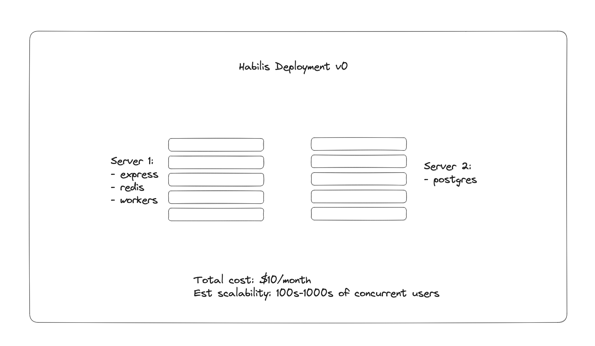

# Kamal Deployment Setup/Basics

These are the notes on setting up [kamal](https://kamal-deploy.org/) for Habilis.

# Part 0: What is the plan?

Here's the plan:



We'll have two servers. One will be our "web server", which receives requests, queries the database, starts workers. The other will be our database, Postgres ("The One True Database™").

# Part 1: Setting up the servers

I went to Hetzner and created both of these servers for us. I was thinking maybe we'd both create one of the servers and split the cost, but then I realized it was $10/month for this setup and the coordination overhead of having you go in and create a thing at this point and report it back to me was just silly at this price point. I trust you will at some point contribute $10/month to this project, and, if not, well, then I guess I will be out tens of dollars.

It's more important that we move fast and keep momentum than optimize $5/month of spend according to fairness. May it always be so between us.

Ok, so we have two servers. Here's their info:


Congrats, we did it!

# Part 2: Installing/initializing kamal

Here's where kamal comes in. These are the steps you should run in your repo to get set up:

```bash
$ gem install kamal
# something like "Fetching kamal-1.5.1.gem" is shown then "1 gem installed"
```

Great, you have kamal. I went ahead and ran `kamal init` so you don't have to. But you are welcome to do so in your repo if you want to see the whole sausage get made. Here, I will show you the result of that. First, I want to draw your attention to this:


This is a folder for kamal-related configs and such. You'll see that currently it's only populated with a `hooks` folder which has some sample hooks we could define to customize the behavior of kamal during deployments. We don't need to touch this today.

Next, let's take a look at this bad boy:


This is a .env file that will hold the secrets that are deployed to our server. I went ahead and didn't commit this file because it will hold our app secrets used at runtime, things like OpenAI API keys and database passwords and whatnot.

**We will need to share this information for you to deploy/run code in the app. So, ask me for the creds and we should eventually come up with some coherent policy for sharing the contents of this file. I will plan to magic-wormhole you the contents during standup or whenever. Note here that this kind of thing can/will be an annoying bottleneck if/when we are doing shared development on diff features and we both modify this file. The issue is that if we deploy without the most up-to-date .env file we could/would break each other's deployments. Since this isn't checked into source code, we can't just pull each other's updates. One solution is to keep the source of truth for this file in 1password and share that credential. Happy to consider other options.**

Ok, long, ranty/bold note over. Let's move onto the last thing to look at:


This is the file that defines our deployment architecture. You'll see things like the IP addresses for each of the two servers. You'll see things like docker image names, and whatnot. I won't go into the gory details of the whole plan here, as our initial setup should last us quite a while without too much hassle. But this is where you go to change deployment stuff (e.g. add a new server that runs our express app, extract redis or the worker container to its own server, etc)

Nice, you made it! These are all the things that were created when I ran `kamal init` in our repo. Note, you don't need to run `kamal init` it's done once, and now, it's done (though if you wanna explore things in a learning environment of sorts, absolutely go for it).

# Part 3: Common operations you'll want to know

The main operations you'll want to know are:

## `kamal env push`

This is an important one to remember, so I'm putting it first. When you write some new code that changes the env variables, that update needs to be proactively pushed to the servers! If you forget this and run `kamal redeploy`, things will not work and may fail in confusing ways. Always run `kamal env push` when you change an environment variable.

## `kamal redeploy`

This will be the primary command you run when interacting with kamal. It will do the following:

- rebuild the docker container for own main app based on your current branch
- push that docker image to our registry
- ssh into the server(s) running that container (behind a traefik load balancer)
- pull the new image
- spin up the new image
- when the new container is healthy, kamal will tell traefik to route to the new container
- kamal will remove the old container

Exactly what you want, nothing you don't. This part I think is fairly straigtforward, though I don't know much about traefik.

## `kamal setup`

If you add a server (due to massive adoption of Habilis), you'll need to run `kamal setup` to make sure it is ready to be managed by kamal. This command basically makes sure docker is present on each of the hosts, then finishes.

## `kamal accessory reboot [name]`

Probably not something you'll run often. But in case redis is on the fritz or you just wanna kick the tires on postgres and see what happens when you turn it off/on again, this is the command to do it. Good to know, but not something I'd expect you or anyone to use regularly.
